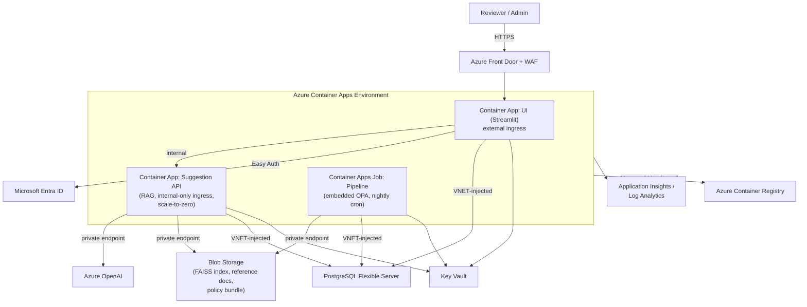
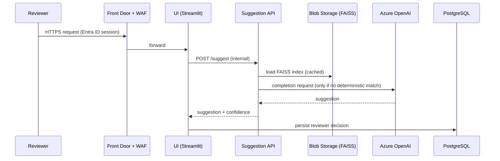
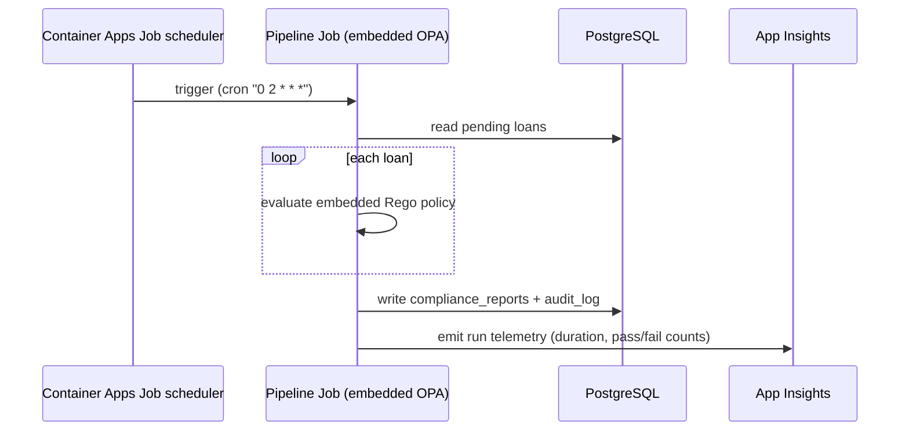

# Loan Compliance System — Production Architecture Plan

> **Status note (reconstruction):** This file was accidentally deleted from disk and had never been committed to git, so it could not be restored from version control or local history. It has been rebuilt from the exact content most recently authored/edited in this session — §12 (CI/CD & IaC) is recovered verbatim from a read performed just before the deletion; the remaining sections have been reconstructed to match the architecture, decisions, and tables already agreed on with the reviewer. Please skim for accuracy and flag anything that looks off.

## 1. Executive summary

The current system is a hackathon-grade prototype: a Go pipeline reading a flat CSV, calling a locally-run OPA server over unauthenticated HTTP, and a Python RAG suggestion agent backed by a FAISS index on local disk — with a Streamlit UI wired on top for demos. This document defines what it takes to run this as a real, production-grade Azure service: compute, data, secrets, networking, identity, observability, cost, and — critically — how code and infrastructure changes actually get deployed.

**Headline decisions:**

| Concern | Decision | Why |
|---|---|---|
| Compute | Single shared **Azure Container Apps Environment** hosting the UI, Suggestion API, and Pipeline as a scheduled Job | Serverless containers, scale-to-zero for the API, no cluster to operate (vs. AKS) |
| Policy evaluation | **Embed OPA via the Go SDK** (`github.com/open-policy-agent/opa/rego`) instead of a separate `opa run --server` process | Removes an unauthenticated network hop and a service to patch/scale independently |
| Structured data | **Azure Database for PostgreSQL Flexible Server** (Burstable tier) | Replaces flat CSV/JSON for loans, compliance reports, and audit history; relational + queryable audit trail |
| Vector store / documents | **Azure Blob Storage** (RA-GRS) holding the FAISS index, reference PDFs, and the Rego policy bundle | Cheaper than Azure AI Search at current scale; explicit migration trigger defined (§10) for when that changes |
| Secrets | **Azure Key Vault + Managed Identity everywhere** | Zero secrets in code, environment files, or CI/CD payloads |
| AI provider | **Azure OpenAI via private endpoint**, dual-provider fallback preserved | Keeps the existing OpenAI/Azure OpenAI abstraction in `retrieval/provider.py`, removes public internet egress for LLM calls |
| Edge / ingress | **Azure Front Door + WAF** in front of the UI only | Single public entry point, managed WAF rules, DDoS protection |
| Identity | **Microsoft Entra ID (Easy Auth)** with Reviewer/Admin roles | SSO, no custom auth code, RBAC enforced at the platform layer |
| Observability | **Application Insights + Log Analytics** | Distributed tracing, centralized logs, alerting |
| Container images | **Azure Container Registry**, admin account disabled | Managed-Identity-only pulls, no shared credentials |
| Infrastructure as code | **Terraform** (not Bicep) | Cloud portability, `terraform plan` as a reviewable change artifact — see §12.1 for the full comparison |

## 2. Well-Architected Framework pillar mapping

| Pillar | Current gap | Target mitigation |
|---|---|---|
| Reliability | Single-process pipeline, no retries, no DR story, flat-file "database" | Container Apps auto-restart/health probes, Postgres automated backups + optional zone redundancy, RA-GRS storage, documented RPO/RTO (§8) |
| Security | Unauthenticated OPA port, secrets in `.env`, no auth on the UI, no network isolation | Embedded OPA (no port), Key Vault + Managed Identity, Entra ID Easy Auth, private endpoints on every data-tier resource, WAF at the edge |
| Cost Optimization | Always-on local processes regardless of load | Scale-to-zero Suggestion API, Burstable-tier Postgres, RAG token-cost reductions already shipped (short-circuit on no-match, trimmed prompts, `max_tokens` cap) |
| Operational Excellence | No CI/CD beyond `go vet`/lint, manual deploys, no IaC | Terraform-managed infra, two-pipeline CI/CD (§12), revision-based blue/green deploys, structured logging |
| Performance Efficiency | Local FAISS load on every run, synchronous per-loan LLM calls | Cached FAISS/company-context lookups (already shipped), goroutine pool with bounded concurrency in the Go pipeline (already shipped, cap 50) |

## 3. Current state vs. target state

| Aspect | Current (hackathon) | Target (production) |
|---|---|---|
| Loan data | `data/loans.csv`, read directly by the Go pipeline | PostgreSQL Flexible Server, `loans` / `compliance_reports` / `audit_log` tables |
| Policy evaluation | Separate `opa run --server` process on port 8181, called over HTTP with no auth | Embedded in the Go binary via the OPA Go SDK; policy bundle loaded from Blob Storage at startup |
| Secrets | Plaintext `.env` file (OpenAI/Azure OpenAI keys, DB creds) | Azure Key Vault, referenced only via each workload's Managed Identity |
| Vector store | Local `retrieval/vector_store/company_reference_faiss/index.faiss` on disk | Same FAISS index, persisted in and loaded from Azure Blob Storage |
| Networking | None — everything runs on localhost | VNET with dedicated Container Apps subnet + private-endpoints subnet; NSG denies all inbound by default |
| Auth | None on the Streamlit UI | Microsoft Entra ID (Easy Auth), Reviewer/Admin roles |
| Observability | `print`/stdout logging only | Application Insights distributed tracing + Log Analytics + alert rules |
| Deployment | Manual `go run` / `streamlit run` on a laptop | Azure Container Apps, Terraform-provisioned, deployed via GitHub Actions |
| IaC | None | Terraform, one state file per environment (dev/staging/prod) |

## 4. Target architecture



## 5. Component-by-component design

- **Container Apps Environment** — one shared environment per environment tier (dev/staging/prod) hosting all three workloads, so they share the same VNET integration and Log Analytics workspace without needing separate clusters.
- **UI (Streamlit)** — external ingress, fronted by Front Door + WAF, authenticated via Entra ID Easy Auth. Calls the Suggestion API over the environment's internal DNS.
- **Suggestion API** — internal-only ingress (never reachable from the public internet directly), `min_replicas = 0` so it scales to zero between review sessions. Talks to Azure OpenAI over a private endpoint and reads the FAISS index from Blob Storage.
- **Pipeline (Container Apps Job)** — runs on a nightly cron schedule (and can be triggered on demand). Embeds OPA directly via the Go SDK rather than calling a separate server, removing the unauthenticated port entirely. Reads from and writes to PostgreSQL.
- **PostgreSQL Flexible Server** — Burstable tier in dev, scaling up per environment (§12's `postgres_sku_name`), VNET-injected with no public network access, replacing the flat CSV/JSON files with real schema for loans, compliance reports, and an append-only audit log.
- **Blob Storage** — RA-GRS replication, three containers: `faiss-index`, `reference-docs`, `policy-bundle`. Chosen over Azure AI Search at current scale (see §10 for the trade-off and the explicit migration trigger).
- **Key Vault** — RBAC-authorization mode (not access policies), purge protection enabled, private endpoint only — every workload reads secrets via its own System-Assigned Managed Identity, never via a shared connection string.
- **Azure OpenAI** — accessed via private endpoint; the existing dual-provider abstraction in `retrieval/provider.py` (OpenAI vs. Azure OpenAI) is preserved so this is a configuration change, not a code rewrite.
- **Azure Front Door + WAF** — the only public entry point in the whole system; fronts the UI exclusively. The Suggestion API and Pipeline Job are never exposed publicly.
- **Microsoft Entra ID (Easy Auth)** — SSO for reviewers, with two roles: **Reviewer** (can review/approve loan suggestions) and **Admin** (can also manage policy bundle versions and view audit history).
- **Application Insights + Log Analytics** — every workload emits structured logs and traces to the same Log Analytics workspace; App Insights provides distributed tracing across the UI → API → Postgres/Blob/OpenAI call chain.
- **Azure Container Registry** — admin account disabled; only Managed Identity–based pulls (`AcrPull` role assignments per workload, see §12.6).

## 6. Sequence diagrams

**Interactive loan review:**



**Nightly compliance pipeline:**



## 7. OWASP Top 10 mapping

| Risk | Mitigation in this design |
|---|---|
| A01 Broken Access Control | Entra ID Easy Auth with Reviewer/Admin roles enforced at the platform layer; internal-only ingress on the Suggestion API and Pipeline Job |
| A02 Cryptographic Failures | TLS everywhere (Front Door, private endpoints); Key Vault encrypts secrets at rest; storage accounts encrypted at rest by default |
| A03 Injection | Parameterized queries against PostgreSQL; Rego policy inputs are structured JSON, not string-interpolated |
| A04 Insecure Design | Threat-modeled boundaries: only the UI is public; every data-tier resource has `public_network_access_enabled = false` |
| A05 Security Misconfiguration | Terraform-managed, PR-reviewed (`terraform plan`) configuration instead of manual portal changes; ACR admin disabled |
| A06 Vulnerable and Outdated Components | Trivy image scanning blocks merges on Critical CVEs (§12.3) |
| A07 Identification and Authentication Failures | No custom auth code — delegated entirely to Entra ID |
| A08 Software and Data Integrity Failures | Images tagged by immutable git SHA, never mutated after push; the exact same digest is promoted dev→staging→prod (§12.5) |
| A09 Security Logging and Monitoring Failures | Application Insights + Log Analytics with alert rules (§9) |
| A10 Server-Side Request Forgery | Azure OpenAI and Blob Storage reached only via private endpoints inside the VNET — no arbitrary outbound calls from application code |

## 8. Reliability, SLA, and disaster recovery

- **Availability target**: 99.9% for the UI/Suggestion API path (Container Apps handles restarts/health probes automatically).
- **RPO**: ≤ 15 minutes for PostgreSQL (automated backups + optional geo-redundant backup in prod, see `postgres_geo_redundant_backup_enabled`), ≤ 1 hour for Blob Storage (RA-GRS async geo-replication).
- **RTO**: ≤ 4 hours for a full environment rebuild, since infrastructure is entirely Terraform-defined and can be re-applied from scratch against restored data.
- **Backups**: PostgreSQL Flexible Server automated backups retained per environment policy; Blob Storage versioning enabled on the `tfstate` container and recommended on `policy-bundle` so a bad policy push can be rolled back.
- **Failure isolation**: separate Terraform state per environment means a bad `dev` apply can never corrupt `staging`/`prod` state or resources.

## 9. Observability

- **Application Insights** (workspace-based) attached to every Container App/Job for distributed tracing and exception tracking.
- **Log Analytics workspace** as the single sink for all container stdout/stderr and platform diagnostic logs.
- **Alerting**: an example scheduled query alert on exception rate is provisioned by Terraform (`infra/modules/monitoring`), routed to an email action group; extend with alerts on Postgres CPU/storage, Container Apps replica count, and OPA policy evaluation failures.
- **Dashboards**: recommended follow-up (not yet provisioned by Terraform) — an Azure Workbook covering request latency, error rate, and nightly pipeline pass/fail counts.

## 10. Cost trade-off justification

| Decision | Chosen option | Alternative considered | Why chosen |
|---|---|---|---|
| Structured data | PostgreSQL Flexible Server (Burstable) | Azure Cosmos DB | Relational audit trail is a natural fit; Cosmos DB's RU-based pricing is harder to predict for this access pattern and is overkill at current scale |
| Vector store | Blob Storage + FAISS | Azure AI Search | Azure AI Search's per-hour cost isn't justified until the reference corpus is large enough to need built-in hybrid/semantic search at scale. **Migration trigger**: revisit if the reference document corpus exceeds ~50k chunks or hybrid keyword+vector search becomes a requirement. |
| Compute | Azure Container Apps | AKS | No cluster control-plane to operate/patch; scale-to-zero fits the bursty Suggestion API workload; Container Apps Jobs cover the scheduled pipeline without needing CronJob/Kubernetes primitives |
| Edge | Azure Front Door + WAF | Application Gateway | Front Door is global, has a managed WAF rule set, and fronts a single app cleanly without needing regional App Gateway instances |
| IaC | Terraform | Bicep | See §12.1 — cloud portability and the `terraform plan` review workflow outweigh the added state-management overhead |

## 11. Estimated monthly cost (rough order of magnitude, dev environment)

| Resource | Estimated monthly cost (USD) |
|---|---|
| Container Apps Environment (UI + API + Job, low traffic, scale-to-zero on API) | ~$30–60 |
| PostgreSQL Flexible Server (Burstable B1ms) | ~$25–35 |
| Blob Storage (RA-GRS, low volume) | ~$5–10 |
| Key Vault | ~$1–3 |
| Azure Container Registry (Basic/Standard) | ~$5–20 |
| Log Analytics + Application Insights (low ingestion) | ~$10–25 |
| Azure OpenAI (usage-based, already cost-optimized per the RAG token-reduction work) | variable, budget-alerted |
| Azure Front Door + WAF | ~$35+ (mostly fixed) |
| **Total (dev, rough)** | **~$110–190/month** |

Staging/prod costs scale up with larger Postgres SKUs, more replicas, and geo-redundant backup — expect roughly 2–4× the dev estimate for prod.

## 12. CI/CD and infrastructure as code

### 12.1 Why Terraform instead of Bicep

Bicep was reconsidered and rejected: it is Azure-only, and this system (and the team's broader portfolio of customers/environments) should not be structurally locked into a single cloud. **Terraform** is the chosen IaC tool:

| Consideration | Terraform | Bicep |
|---|---|---|
| Cloud portability | Same tool/language works for Azure, AWS, GCP — critical if this product is ever run for a customer on a different cloud, or the org standardizes on multi-cloud tooling | Azure Resource Manager only |
| Ecosystem | Huge module registry (`registry.terraform.io`), mature provider ecosystem, large community | Smaller, Azure-only ecosystem |
| Change review workflow | `terraform plan` produces an explicit, human-reviewable diff of every resource that will change, before anything is applied — this is the artifact a change-advisory reviewer actually reads | `what-if` exists but is less universally adopted in review workflows |
| State management overhead | Real, but manageable and well-understood (remote backend + locking, see below) — and it's the cost of the portability benefit above | No state file to manage, but that's inseparable from being Azure-only |

**Verdict**: the state-management overhead is a worthwhile, well-understood trade-off for not being permanently locked to one cloud provider.

### 12.2 Terraform repository layout and state management

```
infra/
├── modules/
│   ├── networking/        # VNET, subnets, NSGs, private endpoints
│   ├── container_apps/    # Container Apps Environment + the 3 apps/jobs
│   ├── postgresql/        # Flexible Server, firewall/private endpoint, backups
│   ├── keyvault/
│   ├── storage/           # Blob containers for FAISS index + PDFs
│   ├── monitoring/        # Log Analytics, App Insights, alert rules, dashboards
│   └── acr/
├── platform/              # Composes all modules into one landing zone
│                          # (NOT a Terraform root itself — no backend/provider)
└── environments/
    ├── dev/       # true Terraform root: backend.tf, calls ../../platform
    ├── staging/   # same, own backend key + tfvars
    └── prod/      # same, own backend key + tfvars
```

This layout is implemented today under [infra/](../infra) — see [infra/README.md](../infra/README.md) for bootstrap and usage instructions, and §12.6 below for the full file-level mapping.

- **One remote state file per environment** (not shared Terraform workspaces) — stored in an Azure Storage Account container (`tfstate`) with **native blob lease locking** to prevent concurrent applies, and **blob versioning enabled** so any bad apply's prior state is recoverable. Using separate state per environment means a mistake in a `dev` apply can never touch `prod`'s state.
- **Authentication from CI/CD to Azure**: GitHub Actions authenticates via **OIDC federated credentials** to an Azure AD App Registration scoped to least-privilege roles per environment — **no long-lived Service Principal client secret is ever stored in GitHub Secrets**. This mirrors the Managed-Identity-everywhere principle used by the application itself (§5).
- Providers are pinned (`required_providers` with exact/pessimistic version constraints) and a committed `.terraform.lock.hcl` ensures reproducible plans across machines/CI runs.

### 12.3 End-to-end CI/CD pipeline design

Two pipelines, kept deliberately separate because they change at different rates and carry different risk: **infrastructure** (Terraform) changes rarely and needs a plan/apply review; **application** (container images) changes on every merge and needs to be fast.

```mermaid
flowchart LR
    subgraph Trigger["On pull request"]
        PR["PR opened / updated"]
    end

    subgraph AppCI["Application CI (per component: pipeline, suggestion-api, ui)"]
        Test["Unit tests:\ngo test ./...\npytest\nopa test policy/"]
        Lint["Lint + static analysis:\ngofmt/govet, ruff, gosec"]
        Scan["Container image scan\n(Trivy / Defender for Containers)"]
        Build["Build multi-stage Docker image"]
    end

    subgraph InfraCI["Infrastructure CI (on infra/ changes)"]
        TFFmt["terraform fmt -check\nterraform validate"]
        TFPlan["terraform plan\n(posted as PR comment)"]
    end

    PR --> Test --> Lint --> Build --> Scan
    PR --> TFFmt --> TFPlan

    subgraph Merge["On merge to main"]
        Push["Push image to ACR\ntag: git-sha + :latest-dev"]
        DeployDev["Deploy to dev\n(auto, no approval)\nterraform apply + az containerapp revision copy"]
        Smoke["Smoke test: GET /health\non every revision"]
    end

    Scan --> Push --> DeployDev --> Smoke

    subgraph Promote["Promotion (manual trigger, same image digest)"]
        Staging["Deploy to staging\n(1 required reviewer)"]
        Prod["Deploy to prod\n(2 required reviewers +\nchange ticket reference)"]
    end

    Smoke -->|"promote workflow_dispatch"| Staging --> Prod
```



**Stage-by-stage detail:**

1. **Test** — `go test ./...`, `opa test policy/` (Rego unit tests), and `pytest` for the deterministic parts of `retrieval/` (all three gaps identified in the earlier engineering audit — this pipeline assumes those tests now exist as a prerequisite for calling this "production grade"). The pipeline **fails closed**: no test, no merge.
2. **Lint/static analysis** — `gofmt`/`go vet`, Python `ruff`, and `gosec`/`bandit` for basic security static analysis.
3. **Build** — one multi-stage Dockerfile per component (`pipeline/`, `retrieval/` API, `app.py` UI), built with BuildKit cache for speed.
4. **Scan** — Trivy (or Microsoft Defender for Containers, which also scans on push to ACR) blocks the merge on any **Critical**-severity CVE.
5. **Push** — image pushed to Azure Container Registry, tagged with the **immutable git commit SHA** (never mutate a tag after push).
6. **Terraform plan (PR)** — any change under `infra/` triggers `terraform plan` against the target environment's state, with the plan output posted as a PR comment for human review before merge — this is the primary control against accidental infrastructure drift or misconfiguration.
7. **Deploy to dev (automatic)** — on merge to `main`, `terraform apply` runs unattended for `dev` only, and the new image is rolled out to the corresponding Container App/Job.
8. **Promotion to staging/prod (manual, gated)** — a separate `workflow_dispatch` promotes the **exact same image digest** (never rebuilt) that passed `dev`, gated by GitHub Environments requiring 1 reviewer for staging and 2 reviewers + a linked change ticket for prod.

### 12.4 Deployment mechanics (how a code change actually reaches users)

This is the part most often left implicit — made explicit here:

- **Container Apps revisions, not in-place overwrites.** Every deploy creates a **new revision** of the Container App. The old revision keeps running until the new one passes its health probe.
- **Traffic-shifted rollout**: the new revision starts at 0% traffic → smoke test hits its `/health` endpoint directly → traffic is shifted to 100% only after the smoke test passes. For `prod`, this can be a gradual shift (e.g., 10% → 100% over a short window) if Application Insights shows no error-rate regression — a lightweight canary pattern using a platform feature, not custom tooling.
- **Rollback is traffic-shifting, not a rebuild.** Because the previous revision is still warm, a bad deploy is rolled back by shifting traffic weight back to the prior revision — near-instant, no rebuild/redeploy cycle required. This is one of the concrete operational benefits of choosing Container Apps' revision model.
- **Database schema migrations** run as an explicit **pre-deploy pipeline step** (a dedicated migration tool — e.g. `golang-migrate` — applying versioned, forward-only SQL migration files against PostgreSQL) **before** the new application revision is given any traffic, so the running code and the schema it expects are never out of sync.
- **Configuration/secrets are never part of the deployment payload.** The new revision reads secrets from Key Vault via its Managed Identity at startup — nothing sensitive is injected via CI/CD variables or baked into the image.
- **The Rego policy bundle** is loaded from Blob Storage at container startup (§15 risk mitigation), so a policy-only change can be rolled out by uploading a new bundle version and restarting/rolling the revision — without necessarily requiring a full application rebuild.

### 12.5 Environment promotion summary

The same container image digest and the same Terraform-planned infrastructure change move through `dev → staging → prod` unmodified — what was tested is exactly what ships. Nothing is ever rebuilt per-environment, which eliminates an entire class of "worked in staging, broke in prod because the build was slightly different" failures.

### 12.6 Implementation status

This section is no longer purely a plan — a starter implementation exists in the repository:

| Plan element | File(s) |
|---|---|
| Terraform child modules | [infra/modules/networking](../infra/modules/networking/main.tf), [keyvault](../infra/modules/keyvault/main.tf), [storage](../infra/modules/storage/main.tf), [acr](../infra/modules/acr/main.tf), [postgresql](../infra/modules/postgresql/main.tf), [monitoring](../infra/modules/monitoring/main.tf), [container_apps](../infra/modules/container_apps/main.tf) |
| Landing-zone composition | [infra/platform/main.tf](../infra/platform/main.tf) |
| Environment roots (state, sizing) | [infra/environments/dev](../infra/environments/dev), [staging](../infra/environments/staging), [prod](../infra/environments/prod) |
| Bootstrap & usage docs | [infra/README.md](../infra/README.md) |
| Component Dockerfiles | [pipeline/Dockerfile](../pipeline/Dockerfile), [retrieval/Dockerfile](../retrieval/Dockerfile), [Dockerfile](../Dockerfile) (UI) |
| Application CI/CD pipeline | [.github/workflows/app-ci.yml](../.github/workflows/app-ci.yml) |
| Infrastructure CI pipeline | [.github/workflows/infra-ci.yml](../.github/workflows/infra-ci.yml) |
| Manual promotion pipeline | [.github/workflows/promote.yml](../.github/workflows/promote.yml) |

One implementation detail worth calling out because it resolves a subtle ownership question in the design above: **Terraform owns the shape of each Container App (replicas, ingress, secrets); the application deploy job owns which image tag is currently running.** Each `azurerm_container_app`/`azurerm_container_app_job` resource has `lifecycle { ignore_changes = [template[0].container[0].image] }`, so a routine `terraform apply` (e.g. a sizing change) can never silently roll a running app back to an older image tag that happens to be in that Terraform run's variables.

**Known limitations of this starter implementation** (should be resolved before any real deployment):

- Not yet run through `terraform validate`/`terraform plan` against a real subscription — no Terraform CLI or Azure credentials were available in the environment this was authored in. Treat these files as a structurally-complete but unverified starting point.
- The remote state storage account (`sttfstateloancompl`) and the Azure AD OIDC app registration must both be created out-of-band first (documented in [infra/README.md](../infra/README.md)) — Terraform cannot bootstrap its own backend.
- No `modules/front_door/` yet (Phase 3 item) — `dev`/`staging` currently expose the UI Container App's own ingress FQDN directly rather than through Front Door + WAF.
- Automated test coverage referenced by `app-ci.yml` (`go test`, `opa test`, `pytest`) will pass trivially until the test-coverage gaps identified in the earlier engineering audit are actually closed.

---

## 13. Phased rollout plan

| Phase | Scope | Outcome |
|---|---|---|
| **Phase 0 — Foundations** | Terraform module skeleton + remote state backend, VNET, Key Vault, ACR, Log Analytics workspace | Empty but secure landing zone |
| **Phase 1 — Lift core services** | Containerize Go pipeline (with embedded OPA) + suggestion API + Streamlit UI; deploy to Container Apps in `dev` | Feature parity with today's demo, but cloud-hosted and privately networked |
| **Phase 2 — Data & identity** | Migrate CSV/JSON to PostgreSQL with run-history schema; wire up Entra ID Easy Auth | Auditable history, real access control |
| **Phase 3 — Edge & hardening** | Add Azure Front Door + WAF in front of the UI; finish alerting/dashboards; promote to `staging` | Public-facing, hardened, observable |
| **Phase 4 — Production cutover** | Load/soak test in `staging`; promote to `prod` via the gated `promote.yml` workflow; decommission the local/manual demo path | Fully production-grade system, old prototype path retired |

## 14. Non-functional requirements summary

| Requirement | Target |
|---|---|
| Availability (UI/API path) | 99.9% |
| Nightly pipeline completion | within its 30-minute job timeout, alerted on failure |
| RPO (PostgreSQL) | ≤ 15 minutes |
| RTO (full environment) | ≤ 4 hours |
| Secrets | Zero secrets in code, env files, or CI/CD logs |
| Data-tier public exposure | None — private endpoints only |
| Image provenance | Every deployed image traceable to an immutable git SHA |

## 15. Risks and mitigations

| Risk | Mitigation |
|---|---|
| Silent-drop of loans on OPA/currency errors (identified in the earlier engineering audit) | Fail closed instead of silently skipping; alert on any evaluation error via Application Insights |
| Terraform state file corruption or lock contention | Native blob lease locking + versioning on the `tfstate` container; one state file per environment so a corrupted `dev` state can never affect `staging`/`prod` |
| Unbounded request body on the Suggestion API (`api_server.py`) | Add an explicit `Content-Length` cap before accepting a request body |
| Vector store outgrows Blob Storage + FAISS | Explicit migration trigger defined in §10 (corpus size / hybrid search requirement) — revisit AI Search at that point |
| Secrets leaking via CI/CD logs | OIDC-only Azure auth (no client secret ever exists to leak), secrets passed as `-var`/`TF_VAR_*`, never echoed |
| Bad deploy reaching all users at once | Revision-based traffic-shifted rollout with health-check gating and near-instant rollback (§12.4) |

## 16. Appendix

- **Assumptions**: single Azure subscription per environment tier; team has (or will provision) an Azure AD tenant for Entra ID Easy Auth; no existing production traffic to migrate live.
- **Open questions**: exact Reviewer/Admin role-to-Entra-group mapping; whether prod needs zone-redundant PostgreSQL HA from day one or can adopt it in a later phase; final SLA target once real usage patterns are known.
- **Related documents**: [infra/README.md](../infra/README.md) for hands-on Terraform usage; workflow files under `.github/workflows/` for the exact CI/CD implementation.
